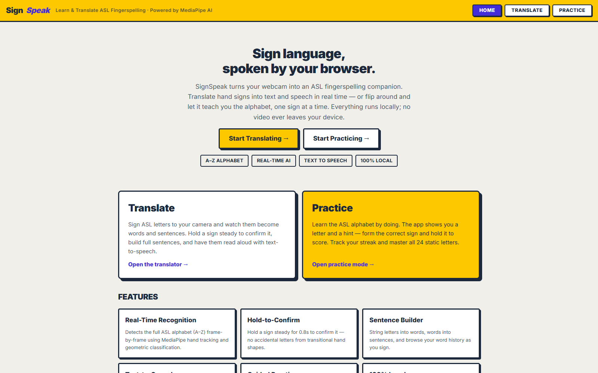
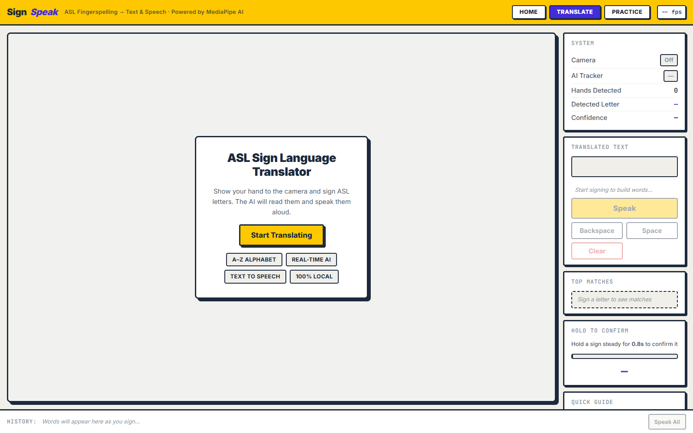
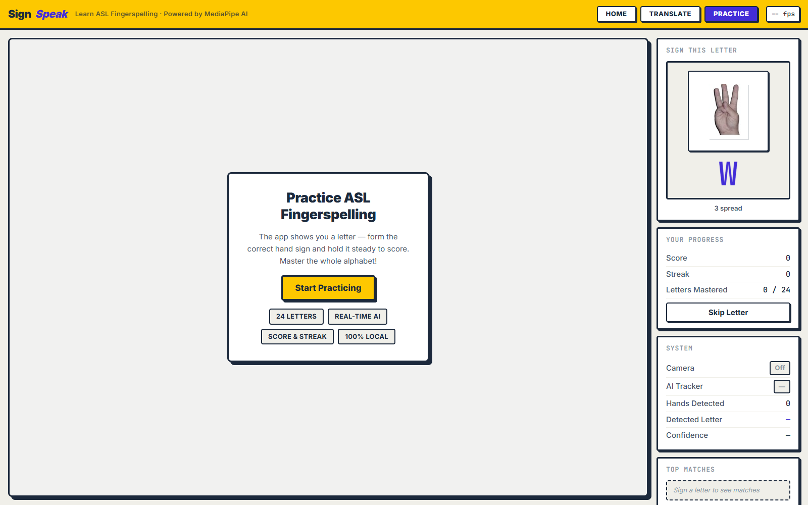

# ASL Sign Language Translator & Practice

A real-time American Sign Language (ASL) fingerspelling platform built as a modern web application. It has three pages:

- **Home (Landing)** — project overview, features, and links to the two tools.
- **Translate** — uses your webcam to detect hand gestures, translates them into text, and reads the translated sentences aloud using text-to-speech.
- **Practice** — teaches you the ASL alphabet: the app shows a target letter and you must form the correct hand sign and hold it steady to score.

## Screenshots

<table>
<tr><td align="center" width="50%"><br/><sub>Landing</sub></td><td align="center" width="50%"><br/><sub>Translate</sub></td></tr>
<tr><td align="center" width="50%"><br/><sub>Practice</sub></td><td></td></tr>
</table>


## Features

- Three-Page Platform: a landing page plus dedicated Translate and Practice pages, linked from the header nav.
- Real-Time ASL Alphabet Recognition: Detects the ASL alphabet (A-Z) using advanced computer vision.
- Hold-to-Confirm: Hold a sign steady for a short duration (0.8s) to confirm a letter, preventing accidental inputs.
- Practice Mode: Random target letters with form hints, score/streak tracking, skip option, and an alphabet progress grid. (J and Z are excluded — they require motion.)
- Word and Sentence Builder: String letters together to form words, and commit words to build full sentences.
- Text-to-Speech Integration: Uses the browser's native Web Speech API to speak the translated text aloud.
- 100% Local Processing: All AI tracking and processing runs locally in your browser for maximum privacy. No video data is sent to external servers.
- Neobrutalism Design System: Features a bold, high-contrast, modern neobrutalist UI with warm surfaces, thick borders, and offset shadows.

## Technology Stack

- Frontend: HTML, CSS (Vanilla, Neobrutalism Design System), JavaScript (ES6 Modules)
- Hand Tracking: Google MediaPipe Tasks Vision (WebAssembly)
- Build Tool: Vite
- Audio: Web Speech API

## Setup and Installation

1. Clone the repository
2. Install dependencies:
   ```bash
   npm install
   ```
3. Start the development server:
   ```bash
   npm run dev
   ```
4. Open your browser and navigate to the local server address provided by Vite (usually http://localhost:5173). The landing page links to the Translate and Practice pages.

## Project Structure

```
index.html        Landing page (project info)
translate.html    Translator page  → src/translate.js
practice.html     Practice page    → src/practice.js
src/appShell.js   Shared camera/AI/UI shell used by both app pages
src/translateMode.js / src/practiceMode.js   Per-page logic
src/handTracker.js / src/aslClassifier.js / src/renderer.js   Shared AI + rendering
```

## How to Use

### Translate Page
1. Open "Translate" from the nav, click "Start Translating" and grant the browser permission to access your camera.
2. Hold your hand in front of the camera and form an ASL letter shape.
3. The AI will highlight your hand and display the detected letter and its confidence score.
4. Hold the sign steady. A progress bar will fill up; once full, the letter is added to your current word.
5. Click "Space" (or the spacebar button in the UI) to commit the word to the sentence.
6. Click "Speak" to have the browser read your sentence aloud.
7. Use the "Backspace" or "Clear" buttons to correct mistakes.

### Practice Page
1. Open "Practice" from the nav, then click "Start Practicing".
2. A target letter is shown with a short hint describing the hand shape.
3. Form the sign with your hand and hold it steady until the progress bar fills.
4. A correct sign scores a point, grows your streak, and marks the letter as mastered in the Alphabet Progress grid.
5. Use "Skip Letter" to move on (resets your streak).

## Accuracy Notes

- Lighting: Ensure you are in a well-lit environment for optimal hand tracking.
- Confusable Letters: Some letters look very similar to the camera (e.g., U and V, M and N). Make sure your hand gestures are clear and deliberate.
- Motion Letters: Letters J and Z typically require motion in ASL. In this static model, they are detected based on their static shape components (similar to I and D respectively).

## License

This project is licensed under the MIT License.
